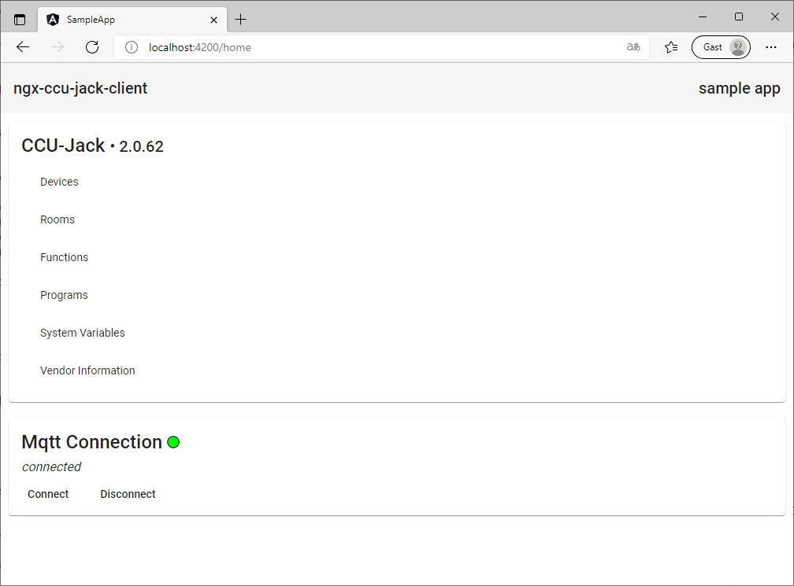

# ngx-ccu-jack-client sample implementation

This sample angular app is based on [Angular Material](https://material.angular.io/) and shows how to use the ```ngx-ccu-jack-client``` library. It uses the ```CcuJackApiService``` and ```CcuJackMqttService``` with all provided functionalities.

## Getting Started

1. Checkout [Repository](https://github.com/pottio/ngx-ccu-jack-client)
2. Install npm packages

    ```
    npm install
    ```

3. Edit ```CcuJackClientConfiguration``` (projects\sample-app\src\environments\environment.ts)

    ```typescript
    const ccuJackClientConfiguration: CcuJackClientConfiguration = {
        connectMqttOnInit: true,
        hostnameOrIp: 'your-hostname-or-ip',
        port: 2122,
        secureConnection: true,
        auth: { user: 'your-user', password: 'your-password' }
    };
    ```

4. Build library

    ```
    npm run build
    ```

5. Start dev server

    ```
    npm run serve
    ```

6. Open browser: <http://localhost:4200/>

## Screenshot


